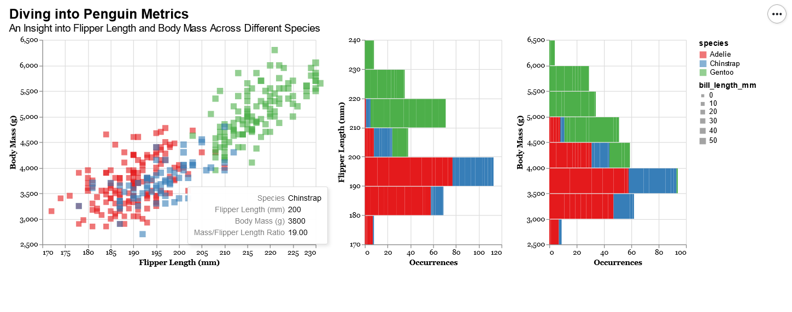
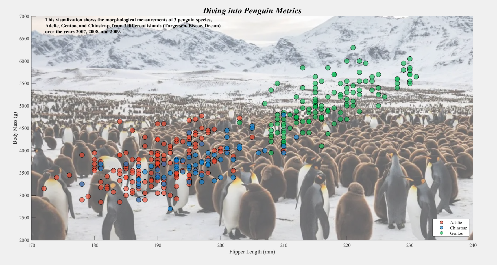
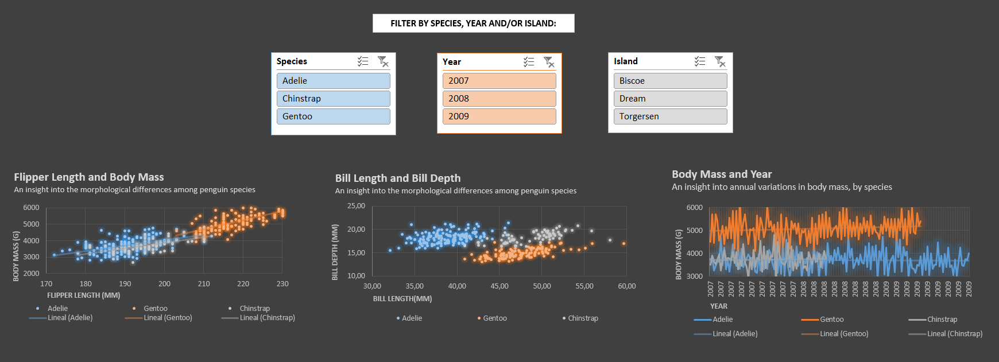
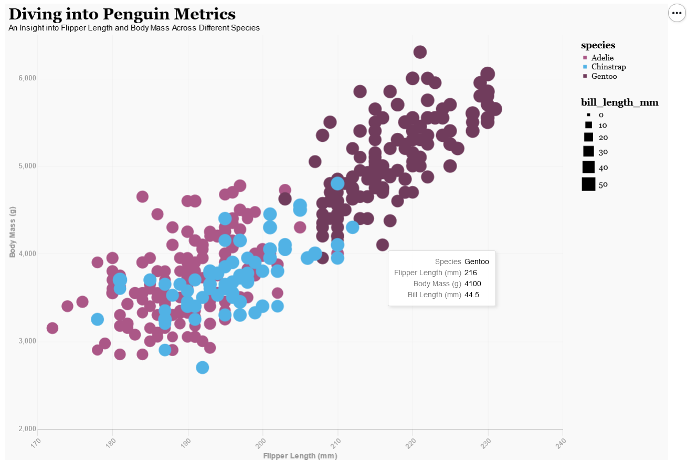

# 02-DataVis-7ways

Assignment 2 - Data Visualization, 7 Ways  
===

# R + ggplot2 + R Markdown

R is a language primarily focused on statistical computing.
ggplot2 is a popular library for charting in R.
R Markdown is a document format that compiles to HTML or PDF and allows you to include the output of R code directly in the document.
To visualize the penguin dataset, I employed ggplot2 and plotly for an interactive chart, highlighting species differences through color, size, and shape aesthetics. Additionally, the chart integrates facet_wrap to differentiate data by island and employs customized scales and themes for clarity and visual appeal. The analysis also calculates a new variable, bill_area_mm (showed on tooltip), for deeper insight, and the chart is made accessible through an HTML widget, served via servr.
The use of ggplot2 and dplyr for data manipulation and visualization was straightforward due to their intuitive syntax and extensive documentation.Setting up the interactive visualization with plotly and serving it through servr was challenging due to the need for integration between R libraries and web techs.

## Technical Achievements:
Interactive Visualization with Plotly: Enhanced user engagement by enabling dynamic interaction, such as mousing over points for detailed metrics on penguin characteristics, alongside integration of a computed variable (bill area) to deepen the analysis.

## Design Achievements:
Aesthetic and Functional Enhancements: I used a consistent color scheme to distinguish between penguin species, optimized font and element sizes for readability, and implemented faceted views by island to compare distributions across species, thereby facilitating comparative analysis in a coherent manner.

# Vega-Lite

Vega-Lite is a simplified, high-level version of Vega, designed for easier and quicker creation of basic charts.
To create the chart, I used Vega-Lite functions to generate a scatterplot with square marks, histograms for flipper length and body mass, and customized axis labels and titles, along with calculated Mass/Flipper Length Ratio and tooltips for species, flipper length, and body mass. This tool makes it easy to quickly generate basic and customizable data visualizations. 

## Technical Achievements:
Interactive features: Tooltips displaying a calculated field (Mass/Flipper Length Ratio) upon mouseover.
Incorporation of binning in the histograms, enabling a more granular analysis of flipper length and body mass by discretizing the data into intervals, which enhances the interpretability of the visualization.

## Design Achievements:
Design coherence through the arrangement of multiple views of the scatterplot and histograms, providing a total exploration of penguin metrics.

# Javascript + d3
JavaScript is a high-level programming language used for creating interactive and dynamic web content.
D3 is a JavaScript library that facilitates data visualization and manipulation by binding data to HTML and SVG elements.
I used various D3 functions such as d3.csv() to load data, d3.scaleLinear() to define scales, d3.axisBottom() and d3.axisLeft() to create axes, and d3.select() to manipulate SVG elements for generating the scatter plot.
The amount of code required to create the plot is quite substantial, spanning multiple lines of code. Nevertheless, it provides multiple configuration functions to enhance the plot and customize it.

## Technical Achievements:
Interactive Tooltips: The code implements interactive tooltips that provide detailed data information upon hover, enhancing user engagement and data exploration.

## Design Achievements:
Aesthetic Appeal: Attention to design details and an appealing color palette contribute to improving the overall user experience.

# Matlab

Matlab is a high-performance programming language and environment used for numerical computing, data analysis, and visualization.
I generated the plot using the scatter function with custom color mapping based on penguin species, transparency settings, and the inclusion of a background image, along with additional annotations and legend.
Creating the scatterplot in Matlab was straightforward with easy customization options for color mapping and annotations; however, handling background images and achieving specific transparency levels required some additional steps.

## Technical Achievements:
Using the readtable function for efficient loading and extraction of data from the 'penglings.csv' file.
Employing the scatter function with custom color mapping, transparency, legend handling, and background image manipulation for a visually enhanced and informative plot.

## Design Achievements:
Integrating a background image to serve as a visually appealing backdrop for the scatterplot.
Creating a descriptive and formatted caption using the annotation function to provide additional context and information within the plot.

# Microsoft Excel

Excel is a spreadsheet program used for organizing, formatting, and calculating data with formulas across a grid of cells.
This visualization contains three linked plots, each providing insights into the morphological differences and annual variations among penguin species. Slicers at the top allow the user to filter the data by species, year, and/or island, which dynamically updates the plots based on the selected criteria.
The slicers make it easy to filter data for interactive insights, but ensuring accurate linkage between slicers and charts required a more detailed arrangement.

## Technical Achievements:
The integration of interactive slicers with multiple plots to dynamically filter and display complex data is a sophisticated technical feature that enhances user engagement and data exploration.

## Design Achievements:
The distinct color coding for each penguin species across all plots creates a visually coherent and immediately understandable representation of the data.
The use of trend lines in each plot, provides immediate visual cues about the relationship between variables for each penguin species, enhancing the viewer's ability to quickly discern correlations within the data.

# Python + Altair
Python is a high-level, interpreted programming language.
Altair is a statistical visualization library for Python, designed to create graphs and charts with a concise and intuitive syntax.
In this Altair code, I used various functions and methods such as alt.Chart, encode, properties, configure_title, configure_axis, configure_legend, configure_view, selection_point, and interactive to create and customize the interactive scatter plot with tooltips, selection, zooming, and panning capabilities, and then saved it as an HTML file.
The library offered a combination of simplicity in syntax, efficient data handling, and the ability to create interactive and aesthetically good visualization with minimal code.

## Technical achievements:
Interactive Selections: The plot has interactive selections that allow users to select specific data points and highlight or filter based on those selections.

## Design Achievements:
Zooming and Panning: This feature allows users to explore different scales of the data interactively. The overall aesthetic choices—such as font selection, title customization, and grid line activation—create a visually appealing chart.

# Tableau

Tableau is a data visualization tool that enables users to create and share interactive and graphical representations of data through dashboards and reports.
This dashboard shows various features such as interactive filters, parameters, dynamic charts (bar chart, scatter plot and line chart), and tooltips for detailed data display upon hover.
Integrating and visualizing data in Tableau was straightforward, highlighting its strength in user-friendly data manipulation and visualization capabilities. The main challenge could involve customizing visualizations to fit specific analytical needs, such as parameters and calculated fields configuration.

Source: https://public.tableau.com/app/profile/antonela.tamagnini/viz/Divingintopenguinmetrics/Dashboard?publish=yes

## Technical achievements:
Utilization of parameters and filters for dynamic data exploration, allowing users to customize data views.
Integration of multiple data visualizations within a single dashboard, facilitating comprehensive data analysis.

## Design Achievements:
Cohesive and user-friendly dashboard design that enhances data comprehension through strategic layout and visualization choices.
